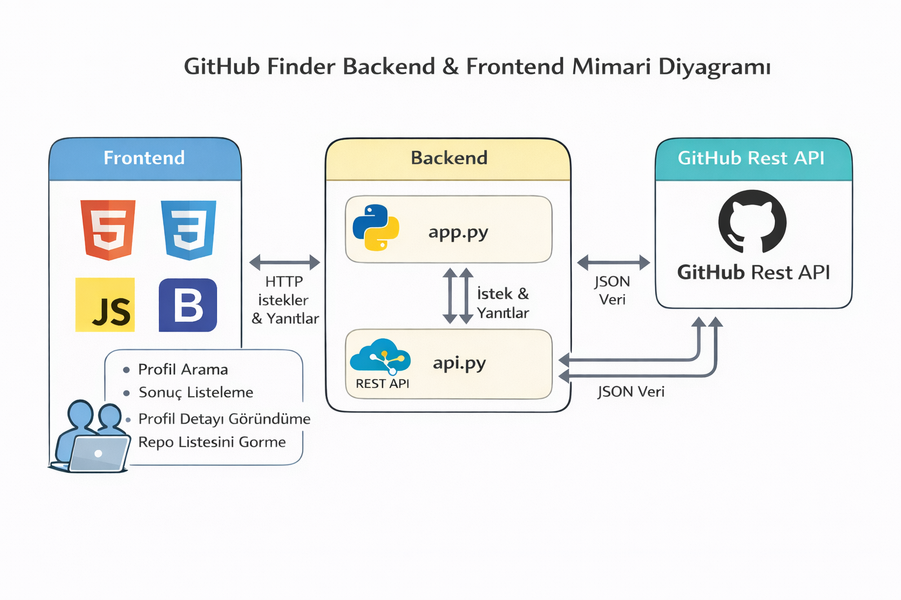

# Flask Rest API GitHub Finder

Bu proje, GitHub API ile haberleşerek kullanıcı arama, arama sonuçlarını listeleme, kullanıcı detaylarını görüntüleme ve ilgili kullanıcının repository listesini çekip doğrudan GitHub linklerine bağlama amacıyla geliştirilmiş bir Flask uygulamasıdır.

Uygulama iki aşamalı bir backend mimarisine sahiptir. `app.py` frontend katmanını ve kullanıcıdan gelen HTTP isteklerini yönetirken, `api.py` GitHub REST API ile doğrudan etkileşime geçer. `api.py`, GitHub API’den alınan JSON veriyi işler, sadeleştirir ve frontend tarafına kullanılabilir bir formatta geri döner. Bu yapı frontend ve harici API iletişimini net şekilde ayırır.

---

## Canlı Uygulama

Projenin canlıdaki haline aşağıdaki bağlantıdan erişebilirsiniz:

[FlaskRestAPIGithubFinder](https://githubfinder.pythonanywhere.com)

---

## Proje Mimarisi

Aşağıda uygulamanın genel mimari yapısını gösteren diyagram yer almaktadır:



---
## Klasör Yapısı
```
Flask-RestAPI-GitHub-Finder/
├── app.py
├── api.py
├── config.py
├── requirements.txt
├── .env.example
├── .gitignore
│
├── static/
│   ├── css/
│   │   └── style.css
│   ├── js/
│   │   └── main.js
│   ├── icons/
│   │   ├── github.svg
│   │   ├── linkedin.svg
│   │   ├── instagram.svg
│   │   └── facebook.svg
│   └── images/
│       └── favicon.png
│
├── templates/
│   ├── layout.html
│   ├── index.html
│   ├── results.html
│   ├── repos.html
│   ├── user.html
│   ├── 404.html
│   └── includes/
│       ├── navbar.html
│       └── footer.html
│
└── screenshots/
    └── githubfinderarch.png
```

## Kurulum

Aşağıdaki adımlar ile projeyi lokal ortamınızda çalıştırabilirsiniz:

```bash
git clone https://github.com/mustafaaesen/Flask-RestAPI-GitHub-Finder.git
cd Flask-RestAPI-GitHub-Finder
python -m venv venv
source venv/bin/activate
pip install -r requirements.txt
python app.py
```
---
Ortam Değişkenleri

Uygulamanın çalışabilmesi için proje kök dizininde bir .env dosyası oluşturulması gerekmektedir. Bu dosya GitHub’a eklenmemelidir.

.env dosyası aşağıdaki değişkenleri içermelidir:

```bash

SECRET_KEY=your_secret_key_here
GITHUB_TOKEN=your_github_access_token_here
```
---
SECRET_KEY: Flask uygulaması için güvenlik anahtarı

GITHUB_TOKEN: GitHub API rate limit sorunlarını önlemek için kullanılan Personal Access Token

.env dosyası .gitignore ile versiyon kontrolü dışında tutulmalıdır.
---

Kullanılan Teknolojiler
```

Python

Flask

GitHub REST API

HTML / CSS

Jinja2 Template Engine
```

---


